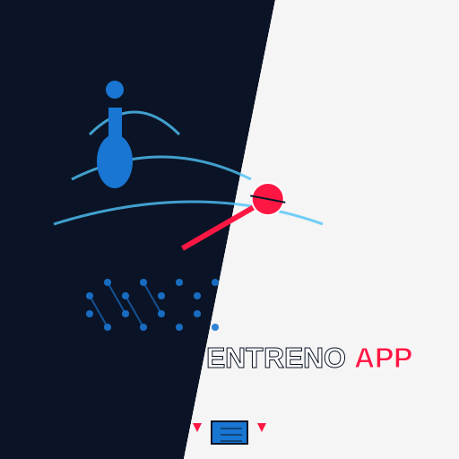

# ✅ Resumen Completo: Integración Nuevo Logo EntrenoApp

**Fecha:** 15 enero 2026  
**Estado:** Todo preparado. Solo falta reemplazar archivos de imagen.

---

## ✅ Lo que está hecho (en el código)

### 1. **Referencias verificadas** ✅
- **191 referencias** a iconos en **56 archivos HTML**
- Todas las rutas apuntan correctamente a `assets/icons/`
- `manifest.json` configurado con todos los iconos
- Schema.org logo URLs correctas

### 2. **Rutas consistentes** ✅
- Favicon: `assets/icons/icon-192x192.png`
- Apple Touch: `assets/icons/apple-touch-icon.png`
- Open Graph: `assets/icons/icon-512x512.png`
- PWA Manifest: `assets/icons/logo-custom.svg`, PNGs

### 3. **CSS preparado** ✅
- `.nav-logo` en `content-pages.css` listo para usar imagen (comentado, listo para activar)
- Estilos responsive incluidos

### 4. **Documentación creada** ✅
- `GUIA-INTEGRAR-NUEVO-LOGO.md` - Guía completa técnica
- `ACTUALIZAR-LOGO-RESUMEN.md` - Resumen ejecutivo
- `LOGO-CHECKLIST-FINAL.md` - Checklist paso a paso

---

## ⏳ Lo que necesitas hacer tú

### Paso 1: Generar archivos de imagen

Exporta el nuevo logo desde tu diseño en estos tamaños:

| Archivo | Tamaño | Formato | Prioridad |
|---------|--------|---------|-----------|
| `icon-192x192.png` | 192×192 px | PNG | ⭐ Alta |
| `icon-512x512.png` | 512×512 px | PNG | ⭐ Alta |
| `apple-touch-icon.png` | 180×180 px | PNG | ⭐ Alta |
| `icon.svg` | SVG escalable | SVG | ⭐ Media |
| `logo-custom.svg` | SVG completo | SVG | ⭐ Media |
| `icon-144x144.png` | 144×144 px | PNG | ⭐ Media (usado en manifest.json) |

**Recomendación:** Genera primero el SVG, luego exporta PNGs desde ahí para mantener calidad.

### Paso 2: Colocar archivos

Copia los archivos generados a:
```
assets/icons/
  ├── icon-192x192.png (reemplazar)
  ├── icon-512x512.png (reemplazar)
  ├── apple-touch-icon.png (reemplazar)
  ├── icon.svg (reemplazar)
  └── logo-custom.svg (reemplazar)
```

**Importante:** Usa exactamente los mismos nombres. Si cambias nombres, tendrás que actualizar código en 56+ archivos.

### Paso 3: Deploy

```bash
git add assets/icons/
git commit -m "Actualizar logo EntrenoApp"
git push
```

Netlify desplegará automáticamente.

### Paso 4: Verificar

- [ ] Abre `https://entrenoapp.com` → verifica favicon en pestaña
- [ ] Comparte una URL en Facebook/Twitter → verifica imagen preview
- [ ] Instala PWA en móvil → verifica icono en home screen
- [ ] Usa [Rich Results Test](https://search.google.com/test/rich-results) → verifica logo en Schema.org

---

## 🎨 (Opcional) Usar logo en navegación

Actualmente la nav usa texto: `💪 EntrenoApp` o `🏃‍♂️ EntrenoApp`

**Si quieres usar el logo como imagen en la nav:**

1. Descomenta el CSS en `css/content-pages.css` (líneas marcadas con `/* Logo como imagen */`)
2. Reemplaza `<a class="nav-logo">💪 EntrenoApp</a>` por:
   ```html
   <a href="/" class="nav-logo">
       
       <span>EntrenoApp</span>
   </a>
   ```
3. Avísame y lo cambio en todos los HTML automáticamente.

---

## 📊 Estadísticas

- **Archivos HTML que referencian iconos:** 56
- **Referencias totales:** 191
- **Archivos de iconos necesarios:** 5-6
- **Tiempo estimado para reemplazar:** 2 minutos (solo copiar archivos)

---

## 🎯 Resumen ultra-rápido

1. **Genera** PNGs (192, 512, 180) y SVG del nuevo logo
2. **Copia** a `assets/icons/` con los mismos nombres
3. **Push** a GitHub → Netlify despliega
4. **Verifica** favicon, og:image, PWA icon

**Todo lo demás ya está hecho.** ✅

---

*Última actualización: enero 2026*
